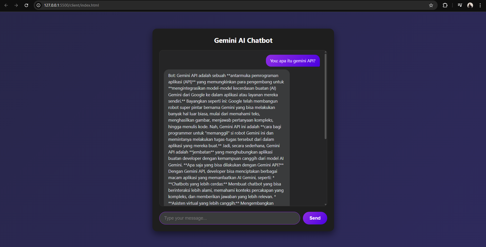

# AI Chatbot with Gemini API

Proyek ini adalah aplikasi chatbot sederhana yang dibangun menggunakan **Node.js** dan **Express** di bagian backend, serta **Vanilla JavaScript** di bagian frontend. Chatbot ini menggunakan model AI **gemini-1.5-flash** untuk memberikan respon yang cepat dan dinamis.

## 👤 Identitas Mahasiswa
* **Nama**: Elok Faiqoh
* **NIM**: 23051204291
* **Program Studi**: S1 Teknik Informatika
* **Instansi**: Universitas Negeri Surabaya

## 📸 Preview

*(Ganti 'preview.png' dengan nama file screenshot chatbot kamu yang ada di dalam folder proyek)*

## 🚀 Fitur
* Integrasi langsung dengan Google Gemini AI API.
* Antarmuka chat yang responsif menggunakan Vanilla JS.
* Instruksi sistem khusus: Asisten yang seru dan hanya menjawab dalam Bahasa Indonesia.

## 🛠️ Teknologi yang Digunakan
* **Backend**: Node.js, Express.
* **Frontend**: HTML, CSS, Vanilla JavaScript.
* **AI Model**: Google Gemini 1.5 Flash.

## ⚙️ Cara Menjalankan
1. Clone repositori ini.
2. Jalankan `npm install` untuk menginstall dependensi.
3. Masukkan API Key Gemini Anda di file konfigurasi.
4. Jalankan server dengan perintah `node index.js`.
5. Buka browser dan akses `localhost:3000`.